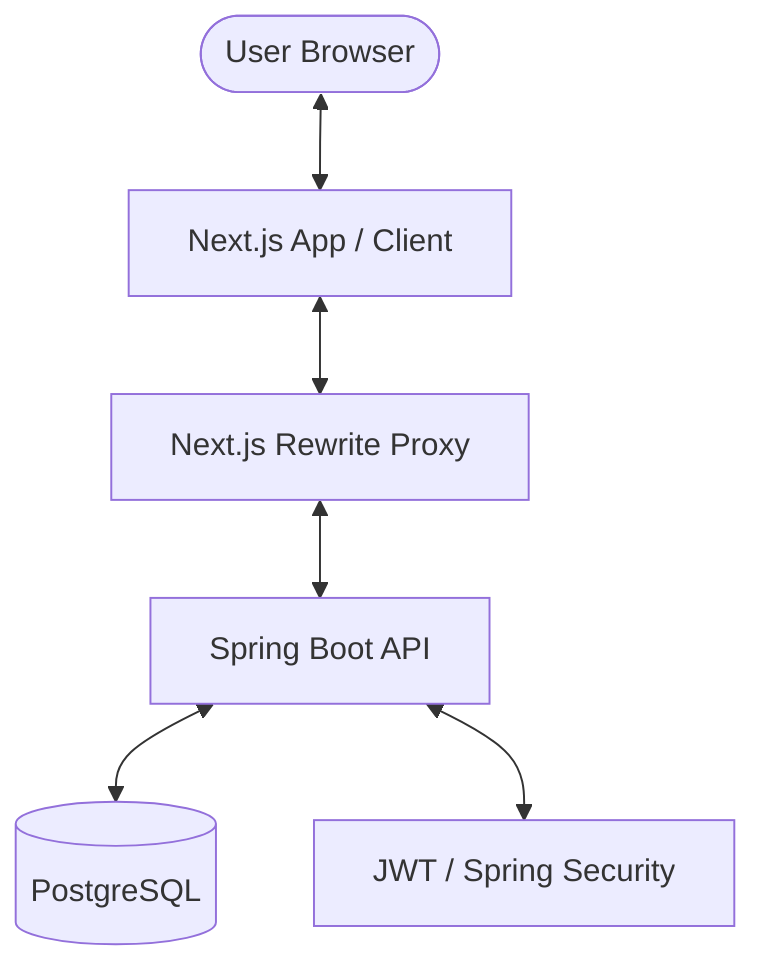

# Vortex Starter: Next.js + Spring Boot Production-Ready Template

A high-performance, full-stack starter kit featuring a modern Next.js frontend and a robust Spring Boot backend. Designed for speed, security, and scalability.

## 📊 System Architecture

### High-Level Flow


### Component Architecture
- **Frontend (Port 5000)**: React Server Components, Tailwind CSS, Lucide Icons.
- **Backend (Port 8080)**: REST API, Spring Data JPA, JWT Authentication.
- **Proxy**: Next.js `rewrites` configured in `next.config.mjs` to route `/auth/*` to the backend.

## 🚀 Tech Stack

### Frontend
- **Framework:** [Next.js](https://nextjs.org/) (App Router, React Server Components)
- **Language:** TypeScript
- **Styling:** Tailwind CSS
- **Fonts:** Next.js Google Font Optimization (Plus Jakarta Sans)
- **Authentication:** JWT stored in `localStorage`

### Backend
- **Framework:** [Spring Boot](https://spring.io/projects/spring-boot) (v3.2.2)
- **Language:** Java 19
- **Database:** PostgreSQL/MySQL with support to H2 DB Fallback
- **Security:** Spring Security with JWT & BCrypt hashing
- **API Documentation:** Swagger UI / OpenAPI 3.0

### Database Support
Vortex supports multiple databases with an automatic zero-config fallback:
- **H2 (Default)**: In-memory database, starts automatically without any setup. Ideal for quick starts. It is the primary option if no credentials are provided.
    - **PostgreSQL**: Supported via environment variables.
    - **MySQL**: Supported via environment variables.

    To switch databases, simply set the following environment variables:
    - `DB_URL`: The JDBC connection string (e.g., `jdbc:postgresql://localhost:5432/db` or `jdbc:mysql://localhost:3306/db`).
    - `DB_USERNAME`: Database username.
    - `DB_PASSWORD`: Database password.
    - `DB_DRIVER`: The driver class name (e.g., `org.postgresql.Driver` or `com.mysql.cj.jdbc.Driver`).
    - `DB_DIALECT`: The Hibernate dialect (e.g., `org.hibernate.dialect.PostgreSQLDialect` or `org.hibernate.dialect.MySQLDialect`).

    If these are not provided, the application will automatically fall back to an in-memory H2 database.

## ✨ Features
- **Full Auth Flow:** Secure Signup and Login with email/password.
- **Persistent Sessions:** State-managed JWT authentication.
- **Hydration Optimized:** Pre-configured for zero hydration mismatches.
- **Database Persistence:** Real PostgreSQL integration (no mock data).

## 🛠 Best Practices
- **Security:** Passwords hashed with BCrypt; Stateless JWT Auth.
- **Clean Code:** Service-Repository pattern in Spring Boot.
- **Performance:** Next.js Image and Font optimization enabled.

## 📦 Deployment

### Production Build
1. **Build Backend**: `cd backend && mvn clean package -DskipTests`
2. **Build Frontend**: `cd frontend && npm install && npm run build`

### Configuration
Ensure `JWT_SECRET_KEY` and `DB_URL` are set in your environment variables. The backend uses `${JWT_SECRET_KEY}` with a default value for local testing.

## 🚦 Getting Started

### 1. Environment Setup
Create a `.env` file in the backend directory with the following variables:

```env
# Database Configuration
DB_URL=ostgresql://<user>:<password>@<host>:<port>/<database>?sslmode=disable
DB_USERNAME=<your_db_user>
DB_PASSWORD=<your_db_password>

# Security
JWT_SECRET_KEY=your_super_secret_jwt_key_here
```
Create a `.env` file in the frontend directory with the following variables:

```env
# The URL of your backend API
NEXT_PUBLIC_API_URL=http://localhost:8080
```

### 2. Running Locally

#### Backend (Spring Boot)
1. Ensure you have Java 17+ and Maven installed.
2. The application is configured to use H2 in-memory database by default, so no setup is required.
3. Run the following command:
```bash
cd backend
mvn spring-boot:run
```
The backend will start on `http://localhost:8080`.

#### Frontend (Next.js)
1. Ensure you have Node.js 18+ installed.
2. Run the following commands:
```bash
cd frontend
npm install
npm run dev
```
The frontend will start on `http://localhost:5000`.

### 3. Production Build & Docker
This template is production-ready. To build the entire stack:
```bash
# Build Backend
cd backend && mvn clean package -DskipTests

# Build Frontend
cd ../frontend && npm install && npm run build
```

## 🌐 Cloud Deployment (Vercel & Render)

### Vercel (Frontend)
1. **Framework Preset:** Next.js
2. **Build Command:** `npm run build`
3. **Environment Variables:** 
   - Add all frontend-specific variables.
   - Set `NEXT_PUBLIC_API_URL` to your Render backend URL.

### Render (Backend)
1. **Service Type:** Web Service
2. **Runtime:** Docker or Java
3. **Build Command:** `mvn clean package -DskipTests`
4. **Start Command:** `java -jar target/demo-0.0.1-SNAPSHOT.jar`
5. **Health Check Path:** `/health`

## 📊 Monitoring & Logging
- **Health Check:** `/health` endpoint available for uptime monitoring.
- **Logging:** Structured Logback logging configured for stdout/stderr (ideal for cloud platform log drains).
